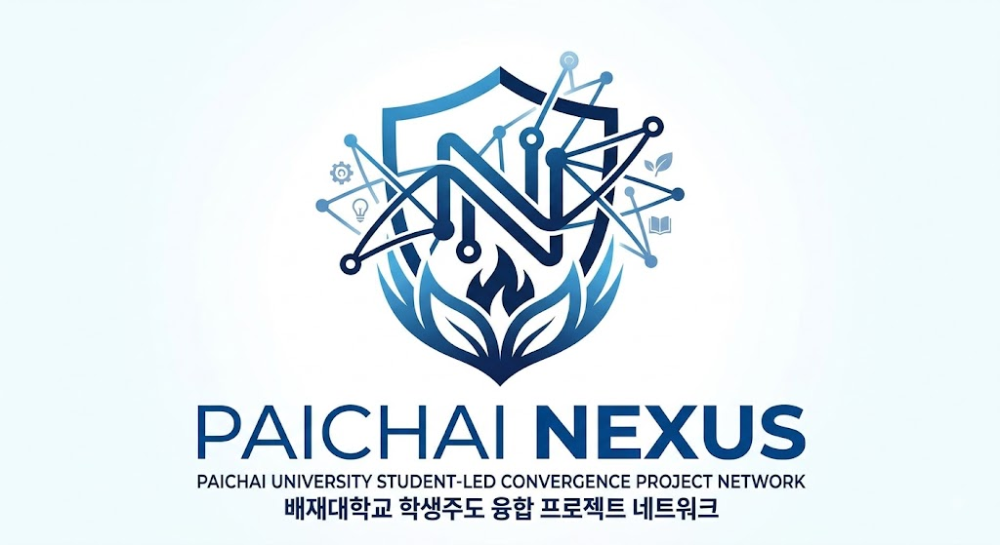

<p align="center">
  
</p>

<h1 align="center">배재대학교 NEXUS</h1>
<h3 align="center">학생 주도 융합 프로젝트 조직</h3>

<p align="center">
  전공을 연결하고, 문제를 해결하고, 결과를 증명하는 팀
</p>

<p align="center">
  <a href="https://github.com/paichai-nexus/smart-seedling-ai">
    
  </a>
  <a href="../docs/MEMBERS.md">
    
  </a>
  <a href="../docs/PROJECT_STANDARD.md">
    
  </a>
</p>

---

## 우리는 어떤 팀인가요?

**NEXUS**는 배재대학교 안에서 다양한 전공의 학생들이 함께 모여,  
실제 문제를 **프로젝트·연구·서비스·공모전·발표**로 연결하는  
**학생 주도 융합 프로젝트 조직**입니다.

단순히 “전공이 다른 학생들이 모였다”에서 끝나는 팀이 아니라,  
각 전공이 실제 역할을 맡아 **기획 → 개발 → 검증 → 결과물**까지 만드는 것을 목표로 합니다.

```text
문제 발견
   ↓
팀 구성
   ↓
기획 / 설계
   ↓
개발 / 연구
   ↓
검증 / 피드백
   ↓
결과물 도출
   ↓
공모전 / 발표 / 논문 / 서비스
```

---

## NEXUS 한눈에 보기

<table>
<tr>
<td align="center" width="25%">
<h3>47명</h3>
<p>2026 조직 구성원</p>
</td>
<td align="center" width="25%">
<h3>19개</h3>
<p>전공 분야</p>
</td>
<td align="center" width="25%">
<h3>8개</h3>
<p>운영 부서</p>
</td>
<td align="center" width="25%">
<h3>1개+</h3>
<p>공개 프로젝트 저장소</p>
</td>
</tr>
</table>

---

## 어떤 사람들이 함께하나요?

NEXUS에는 개발자만 있는 것이 아닙니다.  
기획, 디자인, 행정, 경영, 간호, 식품, 스포츠, 건축, 보안, 철도, 전기전자 등  
다양한 전공의 학생들이 함께합니다.

### 참여 전공 예시

`컴퓨터공학` · `소프트웨어` · `게임공학` · `드론` · `전기전자`  
`철도건설` · `정보보안` · `행정` · `경영` · `IT경영`  
`경찰` · `레저스포츠` · `보건의복` · `식품` · `간호`  
`외식조리` · `미디어콘텐츠` · `건축` · `커뮤니케이션디자인` · `조경`

---

## 우리가 만드는 프로젝트

NEXUS는 전공을 섞기만 하는 팀이 아니라,  
**실제로 결과물이 나오는 프로젝트 구조**를 지향합니다.

### 2026 주요 프로젝트 방향

| 분야 | 프로젝트 | 상태 |
| --- | --- | --- |
| 🌱 원예·산림 | Vision AI 기반 작물 생육 진단 및 맞춤형 방제/시비 솔루션 | 진행중 |
| 🏥 간호 | 대학병원향 통합 의료 정보 시스템(HIS) 및 간호 실무 최적화 | 기획 / 연구 |
| 🧬 생명공학 | BioDockLab 글로벌 임상시험 데이터 관리 및 바이오뱅킹 플랫폼 | 기획 / 연구 |
| 🏗️ 철도·토목 | 도마·도안 터널 구간 지질 특성 분석 기반 구조 안정성 연구 | 연구 |
| ⚽ 스포츠레저 | 엘리트 유소년 선수 매칭 및 경력 관리 O2O 플랫폼 | 기획 |
| 🍽️ FoodTech | Vision AI 기반 Zero-Waste 식재료 인식 및 레시피 추천 | 구상 / 연구 |
| 🧪 FoodTech | AI 메뉴개발 및 소비자 평가 연구 | 구상 / 연구 |

> **중요:**  
> NEXUS는 기획, 구현, 검증, 실증 단계를 구분합니다.  
> “아이디어 있음”과 “검증 완료”를 같은 것으로 취급하지 않습니다.

---

## 대표 공개 프로젝트

### 🌱 Smart Seedling AI

**Vision AI + IoT 기반 개별 모종 생육 모니터링 연구 플랫폼**

[👉 저장소 바로가기](https://github.com/paichai-nexus/smart-seedling-ai)

이 프로젝트는 작물/모종의 생장 상태를 이미지와 센서 기반으로 수집하고,  
Vision AI를 통해 개별 생육 상태를 분석하는 연구형 프로젝트입니다.

```text
모종 / 센서 데이터
      ↓
이미지 및 환경 데이터 수집
      ↓
Vision AI 분석
      ↓
개별 생육 모니터링
      ↓
진단 / 의사결정 보조
      ↓
검증 및 연구 결과
```

---

## NEXUS 조직도

NEXUS는 아래와 같은 **8개 부서 체계**를 기반으로 운영됩니다.

| 부서 | 역할 |
| --- | --- |
| **기획전략부** | 아이디어를 발굴하고 프로젝트와 조직의 방향을 기획 |
| **프로젝트운영부** | 프로젝트 일정·인원·진행상황·리스크를 관리 |
| **연구개발부** | AI·SW·HW·임베디드 등 실제 기술과 결과물을 개발 |
| **디자인·커뮤니케이션부** | 디자인·콘텐츠·SNS·홍보·발표자료 제작 |
| **대외협력부** | 교수·기업·기관·타 대학과의 협력 및 네트워크 담당 |
| **경영지원부** | 예산·구매·회계·회원관리 등 조직 운영 지원 |
| **교육·행사부** | 전공 멘토링·고교/청소년/대학 교육, 동아리 체험 행사 부스 |
| **인문사회·사용자연구부** | 행정·법·심리 등 사회·사용자 관점에서 프로젝트 검토 |

```text
아이디어 발굴
   ↓
팀 구성
   ↓
프로젝트 운영
   ↓
개발 / 연구
   ↓
검증 / 사용자 관점 검토
   ↓
홍보 / 발표 / 대외협력
   ↓
다음 프로젝트로 확장
```

---

## 멤버 구성

NEXUS는 **연도별로 조직을 관리**합니다.  
군 복무, 휴학, 복학, 졸업, 신규 모집, 인수인계 등으로 인해  
활동 멤버 구성이 달라질 수 있기 때문입니다.

### 2026 GitHub 등록 멤버

> 실명 대신 **GitHub 아이디 기준**으로 관리합니다.

| GitHub | 전공 | 역할 |
| --- | --- | --- |
| [@gxmzung](https://github.com/gxmzung) | 컴퓨터공학 | Founder · President |
| [@chan1150](https://github.com/chan1150) | 전기전자 | Member |
| [@haeum8877](https://github.com/haeum8877) | 건축 | Member |
| [@minwoo9](https://github.com/minwoo9) | IT경영 | Member |

추가 멤버는 GitHub 가입 및 조직 초대 완료 후 순차 반영됩니다.

### 2027 조직 구분

| 구분 | 설명 |
| --- | --- |
| **Continuing Members** | 2026에서 계속 활동하는 멤버 |
| **New / Returning Members** | 신규 모집 또는 복귀 멤버 |
| **Project Maintainers** | 프로젝트 지속 운영 담당 |
| **Leadership Transition** | 차기 운영진 / 리더십 인수인계 |

자세한 정책은 아래 문서에서 관리합니다.

- [멤버 및 연도별 로스터 정책 보기](../docs/MEMBERS.md)

---

## NEXUS는 이렇게 일합니다

NEXUS의 프로젝트는 “발표자료만 예쁘게 만들고 끝”나는 방식이 아니라,  
아래처럼 **역할과 근거가 남는 구조**를 추구합니다.

| 단계 | 질문 | 결과물 예시 |
| --- | --- | --- |
| **DISCOVER** | 어떤 문제를 해결할 것인가? | 문제 정의, 배경, 타겟 |
| **DEFINE** | 무엇을 어디까지 할 것인가? | 요구사항, 연구 질문, 범위 |
| **BUILD** | 실제로 무엇을 만들 것인가? | 프로토타입, 시스템, 실험 |
| **VALIDATE** | 이것이 실제로 작동하는가? | 테스트, 사용자 평가, 도메인 검토 |
| **EVIDENCE** | 이를 어떻게 증명할 것인가? | 데이터, 문서, 보고서, 발표, 논문 |

```text
DISCOVER → DEFINE → BUILD → VALIDATE → EVIDENCE → ITERATE
```

---

## 프로젝트 원칙

### 1. 보여주기보다 만들기
발표는 중요하지만, 발표 자체가 결과물은 아닙니다.

### 2. 전공마다 실제 역할이 있어야 함
이름만 올리는 융합이 아니라, 각 전공이 실제 책임을 가져야 합니다.

### 3. 주장보다 근거
구현, 시연, 검증, 실증은 다릅니다.

```text
구상
 ↓
구현
 ↓
시연
 ↓
검증
 ↓
실증
```

### 4. 과정이 남아야 함
README, 문서, 이슈, PR, 결과자료가 남아야 다음 사람이 이어받을 수 있습니다.

### 5. 다음 단계가 있어야 함
좋은 프로젝트는 다음 중 하나로 이어질 수 있어야 합니다.

`공모전` · `연구` · `서비스` · `부스 운영` · `발표` · `산학협력`

---

## 함께할 수 있는 분야

NEXUS는 아래와 같은 분야의 협업을 지향합니다.

`AI` · `SW` · `Embedded` · `UAV / Drone` · `Healthcare IT`  
`Bio AI` · `FoodTech` · `Agri AIoT` · `GIS / 재난안전`  
`공공서비스` · `정책` · `디자인` · `UX` · `사용자 연구`

---

## 외부 협력

NEXUS는 다음과 같은 협력을 열어두고 있습니다.

- 교수 및 연구실
- 기업 및 스타트업
- 공공기관
- 타 대학 학생팀
- 청소년 / 고교 교육 프로그램
- 전공 간 공동 프로젝트

---

## NEXUS에 관심이 있다면

NEXUS는  
**“혼자 잘하는 사람”보다 “함께 결과를 만드는 사람”**을 더 높게 평가합니다.

개발자, 기획자, 디자이너, 연구형 학생, 발표 강점이 있는 학생,  
현장형 문제에 관심 있는 학생 모두 환영합니다.

---

<p align="center">
  <b>배재대학교 NEXUS</b><br>
  <sub>연결로 시작해, 해결로 완성하라.</sub><br><br>
  <sub>Pai Chai University · Daejeon, Republic of Korea</sub>
</p>
