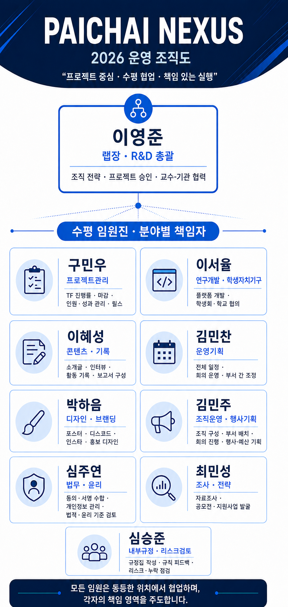

# ?뫁 PAICHAI NEXUS Members & Organization

> **2026 쨌 53 Members 쨌 21 Fields 쨌 Matrix / TF Organization**
> Pai Chai University 쨌 Student-led Interdisciplinary Project Organization

NEXUS??**?섑룊 ?꾩썝吏?Horizontal Executive Council) 쨌 ?꾨줈?앺듃/TF?€(Project) 쨌 湲곕뒫遺€?쒗?(Function) 쨌 ?꾧났 ?ㅽ듃?뚰겕(Major Network)** 瑜?援먯감 ?댁쁺?⑸땲??

```text
PAICHAI NEXUS
?쒋? Lab Lead ??Horizontal Executive Council
?쒋? Project / TF Teams
?쒋? Functional Departments
?붴? College / Major Network
```

> ??硫ㅻ쾭??`?꾧났 + 湲곕뒫遺€??1媛?+ ?꾨줈?앺듃/TF 0~2媛? ?뺥깭濡?李몄뿬?????덉뒿?덈떎.
> ?꾨줈?앺듃 TF??怨쇱뾽 以묒떖?쇰줈 援ъ꽦?섎ʼn 醫낅즺쨌?ы렪?????덉뒿?덈떎.

---


# 🧭 Horizontal Executive Council · 수평 임원진

## 2026 Executive Organization · 운영 조직도

<p align="center">
  
</p>

> 이영준은 **랩장(Lab Lead)** 으로서 조직 전략, 프로젝트 승인, R&D 통합과 교수·기관 협력을 담당합니다.
> 담당 임원 9명은 서열이 아닌 **분야별 책임자(DRI)** 로서 동등한 위치에서 협업합니다.

### Council Roles · 책임 영역

| 역할 | 담당 | 주요 책임 |
| --- | --- | --- |
| **랩장·R&D 총괄** | **이영준** 👴🏻 | 조직 전략, 프로젝트 승인, 교수·기관 협력 |
| **프로젝트관리** | **구민우** 🌳 | TF 진행률, 마감, 참여 인원·성과 관리, 릴스 담당 |
| **연구개발·학생자치기구** | **이서율** ⛄️ | 플랫폼 개발, 학생회·학교 협의 |
| **콘텐츠·기록** | **이혜성** 🔥 | 소개글, 인터뷰, 활동 기록, 보고서 스토리 구성 |
| **운영기획** | **김민찬** 🎃 | 전체 일정, 회의 운영, 부서 간 업무 조정 |
| **디자인·브랜딩** | **박하음** ⭐️ | 포스터, 디스코드, 인스타, 홍보 디자인 |
| **조직운영·행사기획** | **김민주** 🦦 | 조직 구성·부서 배치, 회의 진행, 행사·예산 기획, 구성원 의견수렴 |
| **법무·윤리** | **심주연** 🌱 | 동의·서명 수합, 개인정보 관리, 개발·연구의 법적·윤리적 기준 검토 |
| **조사·전략** | **최민성** 🥔 | 자료조사, 공모전·지원사업 발굴 |
| **내부규정·리스크검토** | **심승준** ❄️ | 규정집·운영원칙 작성, 규칙 개선 피드백, 내부 리스크·누락 점검 |

### Operating Principle · 운영 원칙

- 임원 직책은 서열이 아니라 각자의 **주 책임 영역**을 의미합니다.
- 모든 안건은 담당자, 기한과 결과물을 명확히 기록합니다.
- 프로젝트 내부 업무는 TF장이 책임지고 담당 임원이 지원합니다.
- 법률적 판단이 필요한 사안은 학교 담당 부서나 전문가에게 확인합니다.

---

## Executive Recruitment & Succession 쨌 ?꾩썝 ?곸엯 ?먯튃

> ?꾩썝?€ ?숇쾲쨌?섏씠쨌吏곹븿???꾨땲??**寃€利앸맂 媛뺤젏, 梨낆엫媛? ?묒뾽 ?쒕룄, 湲곕줉怨??몄닔?멸퀎 ?λ젰**??湲곗??쇰줈 ?좎엫?⑸땲??
> ?뱀젙 媛쒖씤??蹂댁쥖?섍린 ?꾪븳 吏곸콉?€ ?먯? ?딆쑝硫? ?꾩슂????븷?€ ?꾩썝吏꾩씠 ?섑룊?곸쑝濡?遺꾨떞?⑸땲??

```text
Verified Strengths + Ownership + Collaboration + Handover
                              ??
                    Executive Candidate Pool
```

---

# ?? Project / TF Teams 쨌 ?꾨줈?앺듃?€

> **硫ㅻ쾭 ?쒖떆:** ?꾨줈?앺듃蹂?李몄뿬?먮뒗 **怨좏븰?????€?숇뀈**, 媛숈? ?숇뀈?먯꽌??**媛숈? ?숆낵쨌?꾧났?쇰━ 臾띠뼱??* ?쒖떆?⑸땲??

## 01. ?뙮 Smart Seedling AI TF
**?먯삁?곕┝ 횞 Vision AI 횞 ROS 2 횞 IoT 횞 Drone 횞 Smart Agriculture**

### Vision AI 湲곕컲 ?묐Ъ ?앹쑁 吏꾨떒 諛?留욎땄??諛⑹젣/?쒕퉬 ?붾（??

?묐Ъ쨌紐⑥쥌 ?대?吏€?€ ?섍꼍 ?곗씠?곕? 異뺤쟻?섍퀬 ?앹쑁 ?곹깭?€ ?댁긽吏뺥썑瑜?遺꾩꽍?섏뿬, ?꾨Ц媛€ 寃€??湲곕컲??諛⑹젣쨌?쒕퉬 ?섏궗寃곗젙??吏€?먰븯???곌뎄 ?뚮옯?쇱엯?덈떎.

**Confirmed Members 쨌 14紐?*

<table>
<tr>
<td align="center" width="25%" valign="top"><br><b>GitHub 以€鍮꾩쨷</b><br><sub><b>源€?꾧퇋</b></sub><br><sub>4?숇뀈 쨌 ?먯삁?곕┝</sub><br><sub><b>Farm Lead</b></sub></td>
<td align="center" width="25%" valign="top"><br><b>GitHub 以€鍮꾩쨷</b><br><sub><b>?닿툑??/b></sub><br><sub>4?숇뀈 쨌 ?먯삁?곕┝</sub><br><sub><b>Smart Farm 쨌 Horticulture</b></sub></td>
<td align="center" width="25%" valign="top"><br><b>GitHub 以€鍮꾩쨷</b><br><sub><b>瑜섏쥌嫄?/b></sub><br><sub>3?숇뀈 쨌 而댄벂?곌났??/sub><br><sub><b>ROS 2 쨌 C++ 쨌 AI Integration</b></sub></td>
<td align="center" width="25%" valign="top"><a href="https://github.com/SeongJun08"><br><b>@SeongJun08</b></a><br><sub><b>?ъ듅以€</b></sub><br><sub>2?숇뀈 쨌 而댄벂?곌났??/sub><br><sub><b>Hardware 쨌 Software</b></sub></td>
</tr>
<tr>
<td align="center" width="25%" valign="top"><a href="https://github.com/h-ng21o"><br><b>@h-ng21o</b></a><br><sub><b>?띿젙??/b></sub><br><sub>2?숇뀈 쨌 而댄벂?곌났??/sub><br><sub><b>Embedded 쨌 Software</b></sub></td>
<td align="center" width="25%" valign="top"><a href="https://github.com/minwoo9"><br><b>@minwoo9</b></a><br><sub><b>援щ???/b></sub><br><sub>1?숇뀈 쨌 IT寃쎌쁺?뺣낫</sub><br><sub><b>Documentation 쨌 Operations</b></sub></td>
<td align="center" width="25%" valign="top"><br><b>GitHub 以€鍮꾩쨷</b><br><sub><b>?좊룞??/b></sub><br><sub>1?숇뀈 쨌 IT寃쎌쁺?뺣낫</sub><br><sub><b>Operations Support</b></sub></td>
<td align="center" width="25%" valign="top"><a href="https://github.com/haeum8877"><br><b>@haeum8877</b></a><br><sub><b>諛뺥븯??/b></sub><br><sub>1?숇뀈 쨌 嫄댁텞</sub><br><sub><b>Farm Structure 쨌 Spatial Design</b></sub></td>
</tr>
<tr>
<td align="center" width="25%" valign="top"><a href="https://github.com/seongjun018"><br><b>@seongjun018</b></a><br><sub><b>諛뺤꽦以€</b></sub><br><sub>1?숇뀈 쨌 ?쒕줎濡쒕큸怨듯븰</sub><br><sub><b>Drone Operations</b></sub></td>
<td align="center" width="25%" valign="top"><a href="https://github.com/wjddbgks4046-ai"><br><b>@wjddbgks4046-ai</b></a><br><sub><b>?뺤쑀??/b></sub><br><sub>1?숇뀈 쨌 ?꾧린?꾩옄怨듯븰</sub><br><sub><b>Electronics 쨌 IoT</b></sub></td>
<td align="center" width="25%" valign="top"><a href="https://github.com/chan1150"><br><b>@chan1150</b></a><br><sub><b>源€誘쇱갔</b></sub><br><sub>1?숇뀈 쨌 ?꾧린?꾩옄怨듯븰</sub><br><sub><b>Electronics 쨌 Field Build</b></sub></td>
<td align="center" width="25%" valign="top"><a href="https://github.com/sera881"><br><b>@sera881</b></a><br><sub><b>?좎꽭??/b></sub><br><sub>1?숇뀈 쨌 議곌꼍</sub><br><sub><b>Landscape 쨌 Planting Environment</b></sub></td>
</tr>
<tr>
<td align="center" width="25%" valign="top"><a href="https://github.com/gxmzung"><br><b>@gxmzung</b></a><br><sub><b>?댁쁺以€</b></sub><br><sub>1?숇뀈 쨌 而댄벂?곌났??/sub><br><sub><b>Project 쨌 System Integration</b></sub></td>
<td align="center" width="25%" valign="top"><br><b>GitHub 以€鍮꾩쨷</b><br><sub><b>?꾩???/b></sub><br><sub>1?숇뀈 쨌 而댄벂?곌났??/sub><br><sub><b>AI Junior 쨌 Data & Vision</b></sub></td>
<td width="25%"></td>
<td width="25%"></td>
</tr>
</table>

| Area | Members | Scope |
| --- | --- | --- |
| ?뙮 Farm / Domain | **源€?꾧퇋**, ?닿툑??| ?띿옣 ?댁쁺, ?묐Ъ쨌?앹쑁 湲곗?, ?ㅻ쭏?명뙗 ?ㅽ뿕 |
| ?쨼 AI / ROS 2 | **瑜섏쥌嫄?*, ?꾩???| C++/ROS 2, Vision AI, ?곗씠?걔룻븰???ㅽ뿕 |
| ?쭛?랅윊?System / Development | **?댁쁺以€**, ?띿젙?? ?ъ듅以€ | HW/SW, Edge, ?쇱꽌쨌?뚮옯???듯빀 |
| ?쉧 Drone | **諛뺤꽦以€** | ?쒕줎 ?댁슜, ??났 珥ъ쁺, ?먭꺽?먯궗 ?뺤옣 |
| ??Electronics / IoT | **?뺤쑀??*, 源€誘쇱갔 | ?쇱꽌, ?꾩썝, 諛곗꽑, IoT, ?꾩옣 ?섎뱶?⑥뼱 |
| ?룛截?Space / Environment | **諛뺥븯??*, ?좎꽭??| ?쒖꽕쨌怨듦컙 援ъ“, ?앹옱쨌議곌꼍 ?섍꼍 |
| ?뱥 Operations / Documentation | **援щ???*, ?좊룞??| 臾몄꽌?? ?쇱젙쨌?뚯쓽쨌?댁쁺 湲곕줉 |

### Faculty Advisory Plan 쨌 援먯닔 ?먮Ц 怨꾪쉷

| 遺꾩빞 | 援먯닔 | ?뚯냽 | ?먮Ц ?붿껌 踰붿쐞 |
| --- | --- | --- | --- |
| ?뙮 Horticulture / Domain | [**?덉쁺吏?援먯닔**](https://hakgwa.pcu.ac.kr/hortforest/88/professor/25700700/4046) | ?먯삁?곕┝?숆낵 | ?묐Ъ쨌?앹쑁 湲곗?, 諛⑹젣쨌?쒕퉬, ?ㅽ뿕 ?ㅺ퀎 諛??먯삁?숈쟻 寃€利?|
| ??Electronics / Control | [**?꾧굅??援먯닔**](https://share.google/E2jCXp6xLHeimAoSl) | ?꾧린?꾩옄怨듯븰怨?| ?쇱꽌쨌?쒖뼱쨌PLC쨌IoT쨌?꾩옣 ?섎뱶?⑥뼱 援ъ꽦 ?먮Ц |
| ?쨼 AI / Software | [**源€李쎌닔 援먯닔**](https://dept.pcu.ac.kr/ce/91/professor/25401701/309) | AI?뚰봽?몄썾?닿났?숇? 而댄벂?곌났?숈쟾怨?| Vision AI쨌?곗씠?걔룻뵆?ロ뤌 ?곌뎄 諛⑺뼢 諛?援먮궡 吏€???꾨줈洹몃옩 ?곌퀎 ?먮Ц |

> ??援먯닔吏꾩? **?먮Ц ?붿껌쨌?곌퀎 ?€??*?쇰줈 ?쒓린?섎ʼn, 怨듭떇 李몄뿬媛€ ?뺤젙?섎㈃ ??븷怨??곹깭瑜?蹂꾨룄濡?媛깆떊?⑸땲??

---

## 02. ?룯 Healthcare HIS TF
**媛꾪샇 횞 Healthcare IT 횞 UX**

?€?숇퀝?먰뼢 ?듯빀 ?섎즺 ?뺣낫 ?쒖뒪??HIS) 援ъ텞 諛?媛꾪샇 ?ㅻТ 理쒖쟻??

**Domain Pool:** 源€誘쇱＜ 쨌 理쒖쑄??쨌 議곗꽌??
**Status:** `FORMING`

## 03. ?㎚ BioDockLab TF
**?앸챸怨듯븰 횞 Clinical Data 횞 Biobanking 횞 Platform**

湲€濡쒕쾶 ?꾩긽?쒗뿕 ?곗씠??愿€由?諛?諛붿씠??諭낇궧 ?뚮옯??援ъ텞.

**Needed:** ?앸챸怨듯븰 Domain 쨌 Backend/Data 쨌 Security 쨌 UX
**Status:** `FORMING`

## 04. ?룛截?Tunnel Stability Research TF
**泥좊룄嫄댁꽕 횞 ?곗씠?곕텇??횞 Research**

?꾨쭏쨌?꾩븞 ?곕꼸 援ш컙??吏€吏??뱀꽦 遺꾩꽍 湲곕컲 ?좊ぉ 援ъ“ ?덉젙???곌뎄 諛??쇰Ц ?ш퀬.

<table>
<tr>
<td align="center" width="25%" valign="top"><a href="https://github.com/minwoo9"><br><b>@minwoo9</b></a><br><sub><b>援щ???/b></sub><br><sub>1?숇뀈 쨌 IT寃쎌쁺?뺣낫</sub><br><sub><b>Documentation 쨌 Research Ops</b></sub></td>
<td align="center" width="25%" valign="top"><br><b>GitHub 以€鍮꾩쨷</b><br><sub><b>?띿???/b></sub><br><sub>1?숇뀈 쨌 泥좊룄嫄댁꽕怨듯븰</sub></td>
<td align="center" width="25%" valign="top"><a href="https://github.com/gxmzung"><br><b>@gxmzung</b></a><br><sub><b>?댁쁺以€</b></sub><br><sub>1?숇뀈 쨌 而댄벂?곌났??/sub></td>
<td width="25%"></td>
</tr>
</table>

**Output:** Dataset 쨌 Analysis Report 쨌 Academic Paper
**Status:** `ACTIVE / RESEARCH`

## 05. ??Elite Youth Sports O2O TF
**?덉??ㅽ룷痢?횞 Platform 횞 Career Data**

?섎━???좎냼???좎닔 留ㅼ묶 諛?寃쎈젰 愿€由?O2O ?뚮옯??

**Domain:** 怨쎈?洹?
**Status:** `FORMING`

## 06. ?띂截?Zero-Waste FoodTech TF
**Vision AI 횞 ?몄떇議곕━ 횞 ?앺뭹?곸뼇**

?앹옱猷??몄떇 ???뚮퉬 ?곗꽑?쒖쐞 ???덉떆??異붿쿇 ???ㅼ“由?룹쁺??寃€利?

<table>
<tr>
<td align="center" width="25%" valign="top"><br><b>GitHub 以€鍮꾩쨷</b><br><sub><b>源€洹쒕━</b></sub><br><sub>3?숇뀈 쨌 ?앺뭹?곸뼇</sub></td>
<td align="center" width="25%" valign="top"><a href="https://github.com/guswls0520"><br><b>@guswls0520</b></a><br><sub><b>?뺥쁽吏?/b></sub><br><sub>1?숇뀈 쨌 ?앺뭹?곸뼇</sub></td>
<td align="center" width="25%" valign="top"><br><b>GitHub 以€鍮꾩쨷</b><br><sub><b>?댁???/b></sub><br><sub>1?숇뀈 쨌 ?몄떇議곕━</sub></td>
<td align="center" width="25%" valign="top"><a href="https://github.com/gxmzung"><br><b>@gxmzung</b></a><br><sub><b>?댁쁺以€</b></sub><br><sub>1?숇뀈 쨌 而댄벂?곌났??/sub></td>
</tr>
</table>

**Status:** `PLANNING / RESEARCH`

## 07. ?럳 Paejae Pick
**Campus Platform 횞 Software 횞 UX 횞 Smart Mobility**

諛곗옱?€?숆탳 ?숈깮 ?앺솢 ?뺣낫?€ 罹좏띁???대룞 ?쒕퉬?ㅻ? ?곌껐?섎뒗 ?숈깮 以묒떖 ?ㅻ쭏??罹좏띁???뚮옯?쇱엯?덈떎.

### Project Organization 쨌 ?꾨줈?앺듃 議곗쭅??

```text
Paejae Pick 2.0
?쒋??€ 媛쒕컻?€?? ?댁쁺以€ (@gxmzung)
?붴??€ ?좎?蹂댁닔: ?댁꽌??(@seoyul1128)
```

| ??븷 | ?대떦 | 梨낆엫 踰붿쐞 |
| --- | --- | --- |
| **媛쒕컻?€??* | [**?댁쁺以€ 쨌 @gxmzung**](https://github.com/gxmzung) | ?쒗뭹 諛⑺뼢, ?꾪궎?띿쿂, ?듭떖 媛쒕컻, ?ㅻ쭏??紐⑤퉴由ы떚 ?곕룞, 媛쒕컻?€ 議곗쑉 |
| **?좎?蹂댁닔** | [**?댁꽌??쨌 @seoyul1128**](https://github.com/seoyul1128) | QA, 踰꾧렇 ?섏젙, 由대━???먭?, 臾몄꽌 媛깆떊, ?댁쁺 ?좎?蹂댁닔 |

**Repository:** [`paichai-nexus/paejae-pick-2-app`](https://github.com/paichai-nexus/paejae-pick-2-app)

**Status:** `ACTIVE / UI DEVELOPMENT`

---


## 08. ?뙋 NEXUS Web Platform TF

**Computer / Software 횞 Design 횞 IT Management 횞 Project Operations**

### PAICHAI NEXUS 怨듭떇 ?뱀궗?댄듃 援ъ텞

NEXUS??議곗쭅쨌硫ㅻ쾭쨌?꾨줈?앺듃/TF쨌援먯닔/湲곌? ?묐젰쨌?깃낵쨌紐⑥쭛 ?뺣낫瑜???怨녹뿉??蹂댁뿬二쇰뒗
**怨듭떇 ???뚮옯??*??援ъ텞?섎뒗 ?대? ?명봽???꾨줈?앺듃?낅땲??

GitHub README??湲멸쾶 ?볦뿬 ?덈뒗 ?뺣낫瑜??뱀궗?댄듃濡?遺꾨━?섏뿬, 諛⑸Ц?먭? 議곗쭅 援ъ“?€ ?꾨줈?앺듃 吏꾪뻾 ?곹솴??
???쎄퀬 吏곴??곸쑝濡??먯깋?????덈룄濡??섎뒗 寃껋쓣 紐⑺몴濡??⑸땲??

**Core Features**

`Home` 쨌 `About NEXUS` 쨌 `Organization` 쨌 `Members` 쨌 `Projects / TF` 쨌 `Partners / Advisors` 쨌 `Achievements` 쨌 `Join NEXUS`

**1李?PoC**

```text
Information Architecture
        ??
Member / Project Data Model
        ??
Organization Page
        ??
Project / TF Page
        ??
Responsive UI
        ??
Deploy
```

**Suggested Stack**

`Next.js / React` 쨌 `TypeScript` 쨌 `GitHub Data` 쨌 `Responsive Web`


---

## 09. ?덌툘 Smart Travel & Airport Experience TF

**愿€愿묎꼍??횞 ?명뀛??났寃쎌쁺 횞 ??났?쒕퉬??횞 湲€濡쒕쾶鍮꾩쫰?덉뒪 횞 ?쇰낯??횞 ?곗뾽?붿옄??횞 愿묎퀬?ъ쭊?곸긽**

### AI 湲곕컲 ?ы뻾쨌怨듯빆 Passenger Journey ?ㅺ퀎 ?뚮옯??

?ы뻾?먭? 異쒕컻 ?꾨???怨듯빆, ?대룞, ?숇컯, 愿€愿묒?源뚯? 寃쏀뿕?섎뒗 ?꾩껜 ?ъ젙??遺꾩꽍?섍퀬,
**AI 湲곕컲 ?쇱젙 異붿쿇怨??쒕퉬??UX瑜?寃고빀?섏뿬 ???몃━???ы뻾 寃쏀뿕???ㅺ퀎?섎뒗 ?꾨줈?앺듃**?낅땲??

?⑥닚 ?ы뻾 異붿쿇 ?깆씠 ?꾨땲??愿€愿뫢룻샇?붋룻빆怨듭꽌鍮꾩뒪 ?꾧났???꾨찓??吏€?앹쓣 湲곕컲?쇰줈
Passenger Journey??遺덊렪 ?붿냼瑜?諛쒓껄?섍퀬 ?ㅼ젣 ?쒕퉬??媛쒖꽑?덉쑝濡??곌껐?섎뒗 寃껋쓣 紐⑺몴濡??⑸땲??

**Project Flow**

```text
Traveler Persona ?뺤쓽
        ??
?ы뻾 紐⑹쟻 / ?쇱젙 / ?덉궛 ?낅젰
        ??
AI 湲곕컲 ?대룞쨌愿€愿??숈꽑 ?앹꽦
        ??
怨듯빆 / ?명뀛 / 愿€愿묒? Touch Point 遺꾩꽍
        ??
?몄뼱쨌臾명솕쨌?쒕퉬??遺덊렪 ?붿냼 ?먯깋
        ??
UX 媛쒖꽑??諛??쒕퉬???꾨줈?좏???
        ??
User Test
```

**Major Roles**

| 遺꾩빞 | ??븷 |
| --- | --- |
| 愿€愿묎꼍??| 愿€愿??숈꽑, 愿€愿묎컼 ?됰룞, 紐⑹쟻吏€ 寃쏀뿕 ?ㅺ퀎 |
| ?명뀛??났寃쎌쁺 | ?숇컯쨌愿€愿??쒕퉬???댁쁺, 怨좉컼 寃쏀뿕 |
| ??났?쒕퉬??| 怨듯빆쨌?묒듅 Passenger Journey, ?쒕퉬??Touch Point |
| 湲€濡쒕쾶鍮꾩쫰?덉뒪 | 湲€濡쒕쾶 ?쒕퉬??紐⑤뜽, ?쒖옣쨌?ъ뾽??遺꾩꽍 |
| ?쇰낯??| ?쇰낯?는룸Ц?붋룹????뺣낫 寃€利?|
| ?곗뾽?붿옄??| ?ㅼ삤?ㅽ겕쨌紐⑤컮???쒕퉬?ㅒ텵MI UX |
| 愿묎퀬?ъ쭊?곸긽 | 愿€愿?肄섑뀗痢? ?곸긽쨌釉뚮옖??肄섑뀗痢?|

**1李?PoC**

`Traveler Persona` 쨌 `Journey Map` 쨌 `AI Itinerary` 쨌 `Airport UX Prototype` 쨌 `User Test`


---

## 10. ?렚 Interactive Culture Tech Studio TF

**怨듭뿰?덉닠 횞 ?꾪듃?ㅼ쎒??횞 寃뚯엫?좊땲硫붿씠??횞 ?섎쪟?⑥뀡 횞 愿묎퀬?ъ쭊?곸긽 횞 ?곗뾽?붿옄??횞 酉고떚耳€??*

### AI쨌?명꽣?숈뀡 湲곗닠 湲곕컲 李몄뿬??臾명솕?덉닠 肄섑뀗痢??쒖옉

怨듭뿰쨌?뱁댆쨌?좊땲硫붿씠?샕룻뙣?샕룹쁺?겶룸뵒?먯씤???섎굹??寃쏀뿕?쇰줈 ?곌껐?섏뿬,
愿€?뚭컼???€吏곸엫?대굹 ?좏깮???곕씪 **?곸긽쨌罹먮┃?걔룹“紐끒룹뿰異쒖씠 ?ㅼ떆媛꾩쑝濡?蹂€?뷀븯???명꽣?숉떚釉?肄섑뀗痢?*瑜??쒖옉?⑸땲??

湲곗닠 ?먯껜媛€ 以묒떖???꾨땲??**臾명솕?덉닠 ?꾧났?먭? 肄섑뀗痢좎? ?곗텧??二쇰룄?섍퀬, 湲곗닠 ?꾧났?먭? 援ы쁽??吏€?먰븯??援ъ“**瑜?吏€?ν빀?덈떎.

**Project Flow**

```text
Theme / Story 湲고쉷
        ??
罹먮┃?걔룸Т?€쨌?섏긽 肄섏뀎???쒖옉
        ??
Camera / Motion Tracking
        ??
?ъ슜???€吏곸엫쨌?좏깮 ?몄떇
        ??
AI Visual / Animation
        ??
?곸긽쨌議곕챸쨌?ъ슫??蹂€??
        ??
Interactive Exhibition / Performance
```

**Major Roles**

| 遺꾩빞 | ??븷 |
| --- | --- |
| 怨듭뿰?덉닠 | 怨듭뿰 援ъ꽦, ?쇳룷癒쇱뒪, 臾대? ?곗텧 |
| ?꾪듃?ㅼ쎒??| ?멸퀎愿€, ?ㅽ넗由? 罹먮┃?걔룸퉬二쇱뼹 |
| 寃뚯엫?좊땲硫붿씠??| 罹먮┃???좊땲硫붿씠?? ?명꽣?숈뀡 |
| ?섎쪟?⑥뀡 | ?섏긽쨌?ㅽ???肄섏뀎??|
| 愿묎퀬?ъ쭊?곸긽 | 珥ъ쁺, ?곸긽 ?곗텧, ?띾낫 肄섑뀗痢?|
| ?곗뾽?붿옄??| ?꾩떆 怨듦컙, ?명꽣?섏씠?? 泥댄뿕 援ъ“ |
| 酉고떚耳€??| 硫붿씠?ъ뾽쨌?ㅽ??쇰쭅쨌鍮꾩＜???곗텧 |

**1李?PoC**

`Story` 쨌 `Character` 쨌 `Motion Tracking` 쨌 `Interactive Visual` 쨌 `Mini Exhibition`

**Final Output**

`Interactive Exhibition` 쨌 `Performance Demo` 쨌 `Short Film` 쨌 `Making Film` 쨌 `Portfolio`


---

### ?뿳截?New TF Vote 쨌 ?좉퇋 ?꾨줈?앺듃 ?ы몴

| 踰덊샇 | ?꾨줈?앺듃 | 紐⑹쟻 |
| ---: | --- | --- |
| **09** | ?덌툘 Smart Travel & Airport Experience | 愿€愿뫢룻빆怨돠룻샇?붋룰?濡쒕쾶 怨꾩뿴 ?좉퇋 李몄뿬 ?뺣? |
| **10** | ?렚 Interactive Culture Tech Studio | 怨듭뿰쨌?⑥뀡쨌?뱁댆쨌?곸긽쨌?붿옄??怨꾩뿴 ?좉퇋 李몄뿬 ?뺣? |

> **08踰?NEXUS Web Platform?€ ?대? ?명봽???꾨줈?앺듃濡?異붿쭊**?섍퀬,
> 09쨌10踰덉? ?좉퇋 ?숆낵 李몄뿬 ?섏슂瑜??뺤씤?섍린 ?꾪븳 **?ы몴 ?꾨낫 TF**濡??댁쁺?⑸땲??

---

# ?㎥ Functional Departments 쨌 遺€?쒗?

## Functional Organization 쨌 遺€???댁쁺 援ъ“

```text
        Lab Lead ??Horizontal Executive Council ??Project / TF Leaders
                                ??
                      FUNCTIONAL DEPARTMENTS
                                ??
        ?뚢??€?€?€?€?€?€?€?€?€?€?€?€?€?р??€?€?€?€?€?€?€?€?€?€?€?€?€?р??€?€?€?€?€?€?€?€?€?€?€?€?€?р??€?€?€?€?€?€?€?€?€?€?€?€?€??
        ??             ??             ??             ??             ??
     ?꾨왂湲고쉷遺€      ?꾨줈?앺듃愿€由щ?      湲곗닠?곌뎄媛쒕컻遺€      ?붿옄?몃툕?쒕뵫遺€
                       (PMO)             (R&D)
        ??             ??             ??             ??
        ?쒋??€?€?€?€?€?€?€?€?€?€?€?€?€?쇄??€?€?€?€?€?€?€?€?€?€?€?€?€?쇄??€?€?€?€?€?€?€?€?€?€?€?€?€??
        ??             ??             ??             ??
     ?€?명삊?λ?      ?ъ뾽湲고쉷쨌吏€?먮?     援먯쑁쨌而ㅻ??덊떚遺€     ?ъ슜?먃룹궗?뚯뿰援щ?
```

> 湲곕뒫遺€?쒕뒗 ?꾩썝吏꾩쓽 ?섏쐞 議곗쭅???꾨땲??**?곸떆 ??웾 ?€**?낅땲?? ?꾨줈?앺듃/TF媛€ 留뚮뱾?댁?硫??꾩슂???몄썝??媛?遺€?쒖뿉??TF濡?援먯감 李몄뿬?⑸땲??
> ?꾩옱 紐낅떒?€ **1李??щ쭩 ?ы몴 湲곕컲 諛곗젙 ?꾨낫**?대ʼn, 遺€?쒖옣 諛?理쒖쥌 ?뚯냽?€ ?댁쁺 ?뚯쓽 ???뺤젙?⑸땲??

### Department Mission

| Department | Main Mission |
| --- | --- |
| ?㎛ **?꾨왂湲고쉷遺€** | ?좉퇋 ?섏젣 諛쒓뎬, 臾몄젣?뺤쓽, ?꾨줈?앺듃 援ъ“?? 濡쒕뱶留돠룹슦?좎닚???ㅼ젙 |
| ?뱥 **?꾨줈?앺듃愿€由щ? 쨌 PMO** | ?쇱젙쨌WBS, ?낅Т遺꾩옣, ?뚯쓽쨌吏꾩쿃 愿€由? ?곗텧臾셋룻쉶怨?愿€由?|
| ?쭛?랅윊?**湲곗닠?곌뎄媛쒕컻遺€ 쨌 R&D** | AI쨌SW쨌HW쨌Embedded쨌Data 援ы쁽, 湲곗닠 寃€利?諛??곌뎄媛쒕컻 |
| ?렓 **?붿옄?몃툕?쒕뵫遺€** | UX/UI, ?쒓컖?? 釉뚮옖???꾩씠?댄떚?? 諛쒗몴?먮즺쨌SNS쨌肄섑뀗痢?|
| ?쩃 **?€?명삊?λ?** | 援먯닔쨌湲곗뾽쨌湲곌?쨌?€?€???묐젰 諛??몃? 而ㅻ??덉??댁뀡 |
| ?뮳 **?ъ뾽湲고쉷쨌吏€?먮?** | ?덉궛, ?ъ뾽怨꾪쉷?? 吏€?먯궗?? 援щℓ쨌?됱젙, ?ъ뾽?붋룹슫?곸???|
| ?럳 **援먯쑁쨌而ㅻ??덊떚遺€** | ?몃??샕룹뒪?곕뵒, ?좉퇋 硫ㅻ쾭 ?⑤낫?? ?됱궗쨌?ㅽ듃?뚰궧쨌而ㅻ??덊떚 ?댁쁺 |
| ?뵊 **?ъ슜?먃룹궗?뚯뿰援щ?** | ?ъ슜??議곗궗, UX Research, ?뺤콉쨌踰빧룹쑄由?룹궗?뚯쟻 ?€?뱀꽦, Human Review |


> **??븷 援щ텇:** ?⑹옣?€ ?꾨줈?앺듃 ?듯빀쨌?€??李쎄뎄, ?섑룊 ?꾩썝吏꾩? 媛?梨낆엫 ?곸뿭??吏€?먃룰??? ?꾨줈?앺듃 ?€?μ? ?대떦 TF???ㅽ뻾 ?섏궗寃곗젙???대떦?⑸땲??
> ?몃? ?쇱젙怨?以묒슂 ?ㅼ쬆?€ **?⑹옣 쨌 ?대떦 ?꾩썝 쨌 ?꾨줈?앺듃 ?€??*???④퍡 ?섑뻾?⑸땲?? ?꾨왂湲고쉷遺€???섏젣瑜??ㅽ뻾 媛€?ν븳 ?꾨줈?앺듃濡?援ъ“?뷀븯怨? PMO???ㅽ뻾怨??꾨즺 湲곕줉??愿€由ы빀?덈떎.


## Major-Aligned Assignment 쨌 1李?湲곕뒫遺€??諛곗젙

> **硫ㅻ쾭 ?쒖떆:** 媛?遺€????떆 **怨좏븰?????€?숇뀈**, 媛숈? ?숇뀈?먯꽌??**媛숈? ?숆낵쨌?꾧났?쇰━ 臾띠뼱??* ?쒖떆?⑸땲??

> **珥?諛곗젙 ?몄썝: 31紐?*
> 以묐났 ?щ쭩?먮뒗 1??1湲곕뒫遺€?쒕? 湲곗??쇰줈 ?뺣━?섎릺, **蹂몄씤 ?щ쭩???곗꽑?섍퀬 ?꾧났 ?곹빀?굿룹씤???꾧났쨌?④낵?€ ?곌퀎?깆쓣 ?ㅼ쓬 湲곗??쇰줈 諛섏쁺**?덉뒿?덈떎.
> `?곷떞 ?꾩슂 / ??븷 留ㅼ묶 以? ?몄썝?€ ?몄썝??洹좊벑 諛곗젙蹂대떎 **?꾧났怨??ㅼ젣 ??웾??媛€???먯뿰?ㅻ읇寃??곌껐?섎뒗 遺€??*瑜??곗꽑?덉뒿?덈떎.
> ?곕씪??遺€?쒕퀎 ?몄썝?€ ?숈씪?섏? ?딆쑝硫? 湲곗닠怨꾩뿴 ?몄썝??留롮? ?꾩옱 援ъ꽦??R&D媛€ 媛€????遺€?쒓? ?섎뒗 寃껋쓣 ?덉슜?⑸땲??

### Assignment Priority

```text
蹂몄씤 ?щ쭩
   ??
?꾧났 ?곹빀??
   ??
?몄젒 ?꾧났 / ?④낵?€ ?곌퀎??
   ??
?꾨줈?앺듃 寃쏀뿕 쨌 媛쒖씤 ??웾
   ??
遺€??理쒖냼 ?댁쁺?몄썝 蹂댁셿
```

### Department Snapshot

| 遺€??| ?몄썝 | ?€??|
| --- | ---: | --- |
| ?㎛ ?꾨왂湲고쉷遺€ | **4** | 誘몄젙 |
| ?뱥 ?꾨줈?앺듃愿€由щ? 쨌 PMO | **4** | **援щ???* |
| ?쭛?랅윊?湲곗닠?곌뎄媛쒕컻遺€ 쨌 R&D | **9** | **瑜섏쥌嫄?* |
| ?렓 ?붿옄?몃툕?쒕뵫遺€ | **3** | 誘몄젙 |
| ?쩃 ?€?명삊?λ? | **2** | 誘몄젙 |
| ?뮳 ?ъ뾽湲고쉷쨌吏€?먮? | **2** | 誘몄젙 |
| ?럳 援먯쑁쨌而ㅻ??덊떚遺€ | **2** | 誘몄젙 |
| ?뵊 ?ъ슜?먃룹궗?뚯뿰援щ? | **5** | 誘몄젙 |
| **?⑷퀎** | **31** |  |


## ?㎛ ?꾨왂湲고쉷遺€ 쨌 4紐?

> **?€?? 誘몄젙**

<table>
<tr>
<td align="center" width="25%" valign="top">

<br><b>GitHub 以€鍮꾩쨷</b><br>
<sub><b>源€洹쒗깭</b></sub><br>
<sub>2?숇뀈 쨌 而댄벂?곌났??/sub>
</td>
<td align="center" width="25%" valign="top">
<a href="https://github.com/shield-761">

<br><b>@shield-761</b>
</a><br>
<sub><b>?뺥븳鍮?/b></sub><br>
<sub>1?숇뀈 쨌 寃뚯엫怨듯븰</sub>
</td>
<td align="center" width="25%" valign="top">

<br><b>GitHub 以€鍮꾩쨷</b><br>
<sub><b>?댁듅誘?/b></sub><br>
<sub>1?숇뀈 쨌 而댄벂?곌났??/sub>
</td>
<td align="center" width="25%" valign="top">

<br><b>GitHub 以€鍮꾩쨷</b><br>
<sub><b>?뺤랬??/b></sub><br>
<sub>1?숇뀈 쨌 ?됱젙??/sub>
</td>
</tr>
</table>


## ?뱥 ?꾨줈?앺듃愿€由щ? 쨌 PMO 쨌 4紐?

> **?€?? 援щ???쨌 1?숇뀈 쨌 IT寃쎌쁺?뺣낫**

<table>
<tr>
<td align="center" width="25%" valign="top">
<a href="https://github.com/minwoo9">

<br><b>@minwoo9</b>
</a><br>
<sub><b>援щ???/b></sub><br>
<sub>1?숇뀈 쨌 IT寃쎌쁺?뺣낫</sub><br><sub><b>?€??쨌 Department Lead</b></sub>
</td>
<td align="center" width="25%" valign="top">
<a href="https://github.com/min020676">

<br><b>@min020676</b>
</a><br>
<sub><b>理쒕???/b></sub><br>
<sub>1?숇뀈 쨌 IT寃쎌쁺?뺣낫</sub>
</td>
<td align="center" width="25%" valign="top">

<br><b>GitHub 以€鍮꾩쨷</b><br>
<sub><b>源€?뱀“</b></sub><br>
<sub>1?숇뀈 쨌 寃뚯엫怨듯븰</sub>
</td>
<td align="center" width="25%" valign="top">
<a href="https://github.com/overflow-52">

<br><b>@overflow-52</b>
</a><br>
<sub><b>?댄삙??/b></sub><br>
<sub>1?숇뀈 쨌 寃쎌같踰뺥븰</sub>
</td>
</tr>
</table>


## ?쭛?랅윊?湲곗닠?곌뎄媛쒕컻遺€ 쨌 R&D 쨌 9紐?

> **?€?? 瑜섏쥌嫄?쨌 3?숇뀈 쨌 而댄벂?곌났??*

<table>
<tr>
<td align="center" width="25%" valign="top">
<a href="https://github.com/jaeh040817">

<br><b>@jaeh040817</b>
</a><br>
<sub><b>?좎옱??/b></sub><br>
<sub>3?숇뀈 쨌 ?뺣낫蹂댁븞??/sub>
</td>
<td align="center" width="25%" valign="top">

<br><b>GitHub 以€鍮꾩쨷</b><br>
<sub><b>瑜섏쥌嫄?/b></sub><br>
<sub>3?숇뀈 쨌 而댄벂?곌났??/sub><br><sub><b>?€??쨌 Department Lead</b></sub>
</td>
<td align="center" width="25%" valign="top">
<a href="https://github.com/SeongJun08">

<br><b>@SeongJun08</b>
</a><br>
<sub><b>?ъ듅以€</b></sub><br>
<sub>2?숇뀈 쨌 而댄벂?곌났??/sub>
</td>
<td align="center" width="25%" valign="top">
<a href="https://github.com/seongjun018">

<br><b>@seongjun018</b>
</a><br>
<sub><b>諛뺤꽦以€</b></sub><br>
<sub>1?숇뀈 쨌 ?쒕줎濡쒕큸怨듯븰</sub>
</td>
</tr>
<tr>
<td align="center" width="25%" valign="top">

<br><b>GitHub 以€鍮꾩쨷</b><br>
<sub><b>二쇳쁽??/b></sub><br>
<sub>1?숇뀈 쨌 ?쒕줎濡쒕큸怨듯븰</sub>
</td>
<td align="center" width="25%" valign="top">
<a href="https://github.com/seoyul1128">

<br><b>@seoyul1128</b>
</a><br>
<sub><b>?댁꽌??/b></sub><br>
<sub>1?숇뀈 쨌 ?뚰봽?몄썾?댄븰</sub>
</td>
<td align="center" width="25%" valign="top">
<a href="https://github.com/wjddbgks4046-ai">

<br><b>@wjddbgks4046-ai</b>
</a><br>
<sub><b>?뺤쑀??/b></sub><br>
<sub>1?숇뀈 쨌 ?꾧린?꾩옄怨듯븰</sub>
</td>
<td align="center" width="25%" valign="top">

<br><b>GitHub 以€鍮꾩쨷</b><br>
<sub><b>源€?숉븯</b></sub><br>
<sub>1?숇뀈 쨌 而댄벂?곌났??/sub>
</td>
</tr>
<tr>
<td align="center" width="25%" valign="top">

<br><b>GitHub 以€鍮꾩쨷</b><br>
<sub><b>臾멸컯誘?/b></sub><br>
<sub>1?숇뀈 쨌 而댄벂?곌났??/sub>
</td>
<td width="25%"></td>
<td width="25%"></td>
<td width="25%"></td>
</tr>
</table>


## ?렓 ?붿옄?몃툕?쒕뵫遺€ 쨌 3紐?

> **?€?? 誘몄젙**

<table>
<tr>
<td align="center" width="25%" valign="top">

<br><b>GitHub 以€鍮꾩쨷</b><br>
<sub><b>?대?以€</b></sub><br>
<sub>2?숇뀈 쨌 而ㅻ??덉??댁뀡?붿옄??/sub>
</td>
<td align="center" width="25%" valign="top">
<a href="https://github.com/h-ng21o">

<br><b>@h-ng21o</b>
</a><br>
<sub><b>?띿젙??/b></sub><br>
<sub>2?숇뀈 쨌 而댄벂?곌났??/sub>
</td>
<td align="center" width="25%" valign="top">
<a href="https://github.com/sera881">

<br><b>@sera881</b>
</a><br>
<sub><b>?좎꽭??/b></sub><br>
<sub>1?숇뀈 쨌 議곌꼍</sub>
</td>
<td width="25%"></td>
</tr>
</table>


## ?쩃 ?€?명삊?λ? 쨌 2紐?

> **?€?? 誘몄젙**

<table>
<tr>
<td align="center" width="25%" valign="top">
<a href="https://github.com/haeum8877">

<br><b>@haeum8877</b>
</a><br>
<sub><b>諛뺥븯??/b></sub><br>
<sub>1?숇뀈 쨌 嫄댁텞</sub>
</td>
<td align="center" width="25%" valign="top">
<a href="https://github.com/jack070401">

<br><b>@jack070401</b>
</a><br>
<sub><b>?μ꽦鍮?/b></sub><br>
<sub>1?숇뀈 쨌 ?꾧린?꾩옄怨듯븰</sub>
</td>
<td width="25%"></td>
<td width="25%"></td>
</tr>
</table>


## ?뮳 ?ъ뾽湲고쉷쨌吏€?먮? 쨌 2紐?

> **?€?? 誘몄젙**

<table>
<tr>
<td align="center" width="25%" valign="top">

<br><b>GitHub 以€鍮꾩쨷</b><br>
<sub><b>沅뚯옱??/b></sub><br>
<sub>1?숇뀈 쨌 IT寃쎌쁺?뺣낫</sub>
</td>
<td align="center" width="25%" valign="top">

<br><b>GitHub 以€鍮꾩쨷</b><br>
<sub><b>?댁???/b></sub><br>
<sub>1?숇뀈 쨌 ?몄떇議곕━</sub>
</td>
<td width="25%"></td>
<td width="25%"></td>
</tr>
</table>


## ?럳 援먯쑁쨌而ㅻ??덊떚遺€ 쨌 2紐?

> **?€?? 誘몄젙**

<table>
<tr>
<td align="center" width="25%" valign="top">
<a href="https://github.com/happurity">

<br><b>@happurity</b>
</a><br>
<sub><b>?ъ＜??/b></sub><br>
<sub>1?숇뀈 쨌 寃쎌같踰뺥븰</sub>
</td>
<td align="center" width="25%" valign="top">
<a href="https://github.com/guswls0520">

<br><b>@guswls0520</b>
</a><br>
<sub><b>?뺥쁽吏?/b></sub><br>
<sub>1?숇뀈 쨌 ?앺뭹?곸뼇</sub>
</td>
<td width="25%"></td>
<td width="25%"></td>
</tr>
</table>


## ?뵊 ?ъ슜?먃룹궗?뚯뿰援щ? 쨌 5紐?

> **?€?? 誘몄젙**

<table>
<tr>
<td align="center" width="25%" valign="top">

<br><b>GitHub 以€鍮꾩쨷</b><br>
<sub><b>議곗꽌??/b></sub><br>
<sub>1?숇뀈 쨌 媛꾪샇</sub>
</td>
<td align="center" width="25%" valign="top">

<br><b>GitHub 以€鍮꾩쨷</b><br>
<sub><b>源€誘쇱＜</b></sub><br>
<sub>1?숇뀈 쨌 媛꾪샇</sub>
</td>
<td align="center" width="25%" valign="top">
<a href="https://github.com/jeonghawaii07">

<br><b>@jeonghawaii07</b>
</a><br>
<sub><b>源€?뺥솚</b></sub><br>
<sub>1?숇뀈 쨌 蹂닿굔?섎즺蹂듭?</sub>
</td>
<td align="center" width="25%" valign="top">

<br><b>GitHub 以€鍮꾩쨷</b><br>
<sub><b>?좏슚由?/b></sub><br>
<sub>1?숇뀈 쨌 蹂닿굔?섎즺蹂듭?</sub>
</td>
</tr>
</table>

### Assignment Notes

- **?꾧린?꾩옄 쨌 ?쒕줎濡쒕큸 쨌 ?뺣낫蹂댁븞 쨌 而댄벂??SW 怨꾩뿴**?€ 湲곕낯?곸쑝濡?湲곗닠?곌뎄媛쒕컻遺€ R&D?€???곹빀?깆쓣 ?곗꽑?덉뒿?덈떎.
- **?붿옄?몃툕?쒕뵫遺€**??而ㅻ??덉??댁뀡?붿옄?몄쓣 以묒떖?쇰줈, ?붿옄???щ쭩?먯? 議곌꼍 ???몄젒 ?쒓컖쨌怨듦컙 ?꾧났??諛곗튂?덉뒿?덈떎.
- **?ъ슜?먃룹궗?뚯뿰援щ?**??蹂닿굔?섎즺蹂듭?쨌媛꾪샇 ???ъ슜?먃룻쁽??愿€李곌낵 寃€利앹뿉 媛뺥븳 ?꾧났???곗꽑 諛곗튂?덉뒿?덈떎.
- 以묐났 ?щ쭩?먮뒗 理쒖큹 ?щ쭩??臾댁떆?섏? ?딄퀬, ?ㅻⅨ 遺€?쒖쓽 ?곹빀?꾩? 鍮꾧탳?섏뿬 理쒖쥌 1媛?遺€?쒕줈 ?뺣━?덉뒿?덈떎.
- 湲곕뒫遺€?쒕뒗 怨좎젙 ?좊텇???꾨땲???쒕룞 寃곌낵?€ 蹂몄씤 ?щ쭩???곕씪 ?대룞?????덉뒿?덈떎.

---

# ?룶 College / Major Network 쨌 ?④낵?€쨌?꾧났 ?ㅽ듃?뚰겕

?꾧났 ?ㅽ듃?뚰겕??媛?硫ㅻ쾭媛€ ?꾨줈?앺듃?먯꽌 ?쒓났??**?꾨찓???꾨Ц??*??蹂댁뿬以띾땲??


## ?몃Ц?ы쉶?€??쨌 3紐?

| ?꾧났 | 硫ㅻ쾭 |
| --- | --- |

| ?됱젙??| ?뺤랬??(1?숇뀈) |

| 寃쎌같踰뺥븰 | [**?댄삙??쨌 @overflow-52**](https://github.com/overflow-52) (1?숇뀈), [**?ъ＜??쨌 @happurity**](https://github.com/happurity) (1?숇뀈) |


## 寃쎌쁺?€??쨌 5紐?

| ?꾧났 | 硫ㅻ쾭 |
| --- | --- |

| 寃쎌쁺??| 臾몄떆??(1?숇뀈) |

| IT寃쎌쁺?뺣낫 | [**援щ???쨌 @minwoo9**](https://github.com/minwoo9) (1?숇뀈), 沅뚯옱??(1?숇뀈), ?좊룞??(1?숇뀈), [**理쒕???쨌 @min020676**](https://github.com/min020676) (1?숇뀈) |


## ?앸챸蹂닿굔?€??쨌 10紐?

| ?꾧났 | 硫ㅻ쾭 |
| --- | --- |

| 蹂닿굔?섎즺蹂듭? | [**源€?뺥솚 쨌 @jeonghawaii07**](https://github.com/jeonghawaii07) (1?숇뀈), ?좏슚由?(1?숇뀈) |

| ?앺뭹?곸뼇 | 源€洹쒕━ (3?숇뀈), [**?뺥쁽吏?쨌 @guswls0520**](https://github.com/guswls0520) (1?숇뀈) |

| 媛꾪샇 | 源€誘쇱＜ (1?숇뀈), 理쒖쑄??(1?숇뀈), 議곗꽌??(1?숇뀈) |

| ?몄떇議곕━ | ?댁???(1?숇뀈) |

| ?먯삁?곕┝ | ?닿툑??(4?숇뀈), 源€?꾧퇋 (4?숇뀈) |


## AI쨌SW李쎌쓽?듯빀?€??쨌 27紐?

| ?꾧났 | 硫ㅻ쾭 |
| --- | --- |

| 而댄벂?곌났??| [**?ъ듅以€ 쨌 @SeongJun08**](https://github.com/SeongJun08) (2?숇뀈), [**?띿젙??쨌 @h-ng21o**](https://github.com/h-ng21o) (2?숇뀈), 源€洹쒗깭 (2?숇뀈), [**?댁쁺以€ 쨌 @gxmzung**](https://github.com/gxmzung) (1?숇뀈), 源€?숉븯 (1?숇뀈), ?댁듅誘?(1?숇뀈), 理쒗깭??(1?숇뀈), 臾멸컯誘?(1?숇뀈), ?꾩???(1?숇뀈), 源€以€誘?(1?숇뀈), ?뚯???(1?숇뀈), 理쒖씠??(1?숇뀈), 理쒖닔??(1?숇뀈) |

| ?뚰봽?몄썾?댄븰 | [**?댁꽌??쨌 @seoyul1128**](https://github.com/seoyul1128) (1?숇뀈) |

| 寃뚯엫怨듯븰 | 源€?뱀“ (1?숇뀈), [**?뺥븳鍮?쨌 @shield-761**](https://github.com/shield-761) (1?숇뀈) |

| ?쒕줎濡쒕큸怨듯븰 | [**諛뺤꽦以€ 쨌 @seongjun018**](https://github.com/seongjun018) (1?숇뀈), 二쇳쁽??(1?숇뀈), ?ㅺ꼍??(1?숇뀈) |

| ?꾧린?꾩옄怨듯븰 | [**源€誘쇱갔 쨌 @chan1150**](https://github.com/chan1150) (1?숇뀈), [**?뺤쑀??쨌 @wjddbgks4046-ai**](https://github.com/wjddbgks4046-ai) (1?숇뀈), [**?μ꽦鍮?쨌 @jack070401**](https://github.com/jack070401) (1?숇뀈) |

| 泥좊룄嫄댁꽕怨듯븰 | ?띿???(1?숇뀈) |

| ?뺣낫蹂댁븞??| [**?좎옱??쨌 @jaeh040817**](https://github.com/jaeh040817) (3?숇뀈), ?닿굔??(2?숇뀈), 源€?쒗븯 (1?숇뀈), 源€吏€??(1?숇뀈) |


## 臾명솕?덉닠?€??쨌 8紐?

| ?꾧났 | 硫ㅻ쾭 |
| --- | --- |

| ?덉??ㅽ룷痢?| [**怨쎈?洹?쨌 @minixdbxkyuu**](https://github.com/minixdbxkyuu) (1?숇뀈) |

| 誘몃뵒?댁퐯?먯툩 | ?먯???(1?숇뀈) |

| 嫄댁텞 | [**諛뺥븯??쨌 @haeum8877**](https://github.com/haeum8877) (1?숇뀈), ?μ???(1?숇뀈) |

| 而ㅻ??덉??댁뀡?붿옄??| ?대?以€ (2?숇뀈), ?묒슦吏?(1?숇뀈), ?좎쑀吏?(1?숇뀈) |

| 議곌꼍 | [**?좎꽭??쨌 @sera881**](https://github.com/sera881) (1?숇뀈) |


---

# ?뱤 Organization Snapshot

| 援щ텇 | ?꾪솴 |
| --- | ---: |
| ?꾩껜 ?쒕룞 援ъ꽦??| **53紐?* |
| 李몄뿬 ?꾧났 / 遺꾩빞 | **21媛?* |
| 湲곕뒫遺€??| **8媛?* |
| Project / TF | **怨쇱뾽蹂??꾨젰 ?댁쁺** |
| 議곗쭅 援ъ“ | **Matrix + TF** |

---

# ?봽 Role & Handover Policy

- ??硫ㅻ쾭???щ윭 TF??李몄뿬?????덉?留??듭떖 ?꾨줈?앺듃??`0~2媛?瑜?沅뚯옣?⑸땲??
- ?꾧났?€ ?ㅼ젣 ?숈깮 ?뚯냽, 湲곕뒫遺€?쒕뒗 吏€????웾, TF???ㅼ젣 臾몄젣 ?닿껐 ?⑥쐞濡?湲곕줉?⑸땲??
- GitHub 怨꾩젙???뺤씤??硫ㅻ쾭???꾨줈???대?吏€?€ 怨꾩젙???곌껐?⑸땲??
- TF 醫낅즺 ?꾩뿉??肄붾뱶쨌?곗씠?걔룸Ц?쑣룸컻?쒖옄猷뙿룹뿭?졖룹쓽?ш껐??湲곕줉???④퉩?덈떎.
- 援?蹂듬Т쨌?댄븰쨌蹂듯븰쨌議몄뾽쨌?좉퇋 紐⑥쭛?€ ?곕룄蹂?濡쒖뒪?곕줈 愿€由ы빀?덈떎.

```text
IDEA ??TF FORMATION ??DEFINE ??BUILD ??VALIDATE ??EVIDENCE ??CONTINUE / CLOSE
```

---

<p align="center"><b>PAICHAI NEXUS</b><br>LAB COUNCIL 쨌 PROJECT / TF 쨌 FUNCTION 쨌 MAJOR NETWORK</p>
<p align="center"><sub>?щ엺???뉕퀬, 媛€?μ꽦???대떎.</sub></p>
